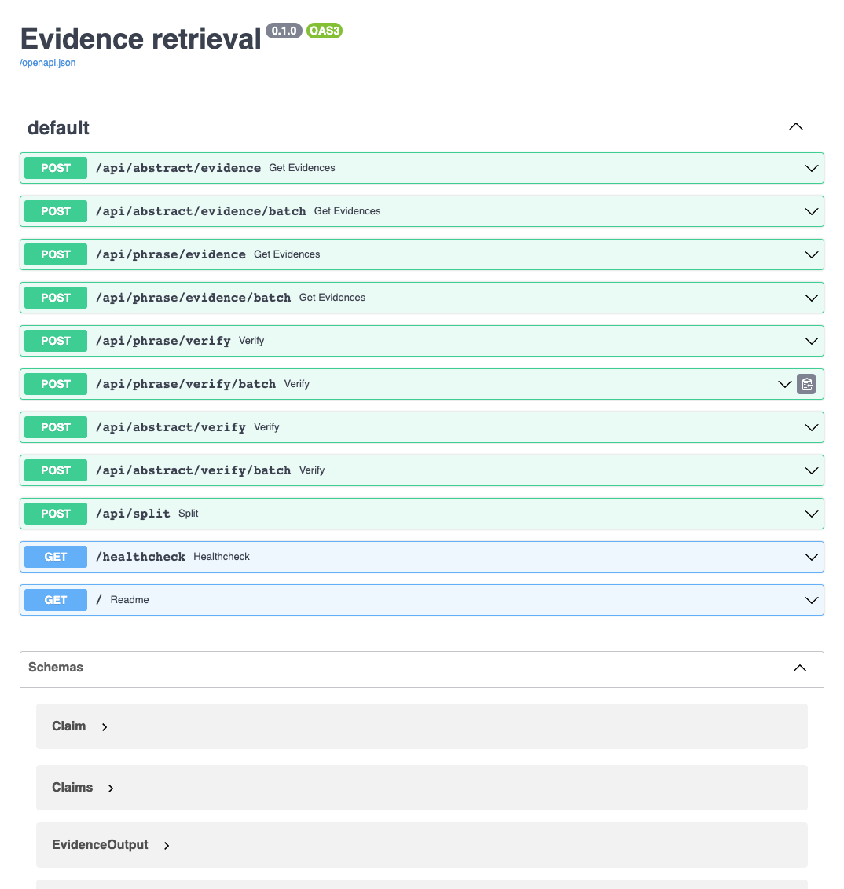
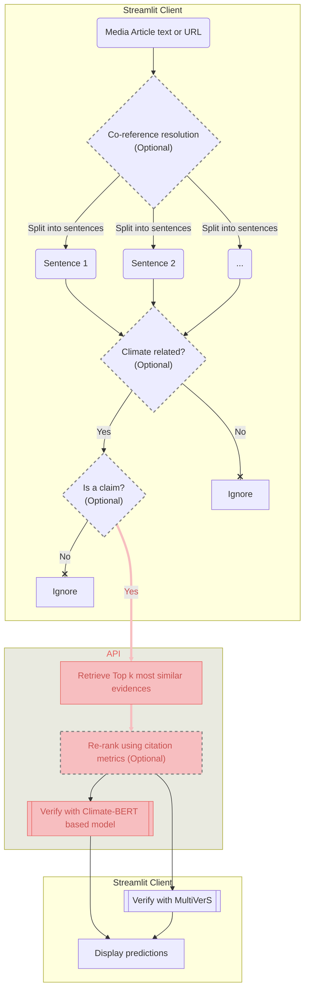

# Relevant Scientific Evidence Retrieval and Verification API for Climate impact related queries

## Overview

The API is created to perform scientific verification of claims
extracted from Climate Change related news articles in order to detect
potential inaccuracies of the latter.

### General workflow

## Main functionality
**The API performs 2 main tasks**
- Evidence retrieval for given claim(s) under all `evidence` endpoints
- Evidence retrieval + verification for given claim(s) under all `vefify` endpoints
- Supplementary task of splitting text into sentences under `split` endpoint
to enable Chrome extension functioning

### Scientific evidences index and database
Please refer to the dedicated [Evidence database creation](doc/db.md) section

### Most relevant evidence retrieval

Performed using [Haystack framework](https://haystack.deepset.ai/) that facilitates
fast dense vector retrieval and the sentence encoder models
described [here](doc/db.md#model-for-sentence-embeddings)
The number of evidence candidates to retrieve is defined by the `top_k` parameter 

### Evidence Re-ranking

If the `re_rank` parameter is set to `true` the following actions are performed
1. 5 more than the set `top_k` most semantically similar evidence candidates get retrieved
for each input claim. 
2. The candidate evidences get sorted in descending order according to the following parameters:
   1. Number of [influential citations](https://www.semanticscholar.org/faq#influential-citations) 
   i.e., citations that indicate that the cited work is 
   used or extended in the new effort [[1]](#references)
   2. Number of [all citations](https://www.semanticscholar.org/faq#estimated-citations)
   3. Publication year

### Model for claim verification against retrieved evidence

[Climatebert-fact-checking model](https://huggingface.co/amandakonet/climatebert-fact-checking) 
available from huggingface.
It's a ClimateBERT [[2]](#references) model fine-tuned 
on [CLIMATE-FEVER](https://www.sustainablefinance.uzh.ch/en/research/climate-fever.html)
dataset 
[[3]](#references)

### Split into sentences
[Spacy "en_core_web_sm" pipeline](https://spacy.io/models/en#en_core_web_sm)
is used for text segmentation task  
This model is the smallest and the fastest and according to spacy's 
[Accuracy Evaluation](https://spacy.io/models/en#en_core_web_sm-accuracy) has
the same metric values as the bigger CPU-optimized models

### API description
In all the examples below `batch` endpoint accepts 
an array of input sentences rather than a single
sentence

#### `abstract` Endpoints

All the following endpoints perform searches against
the database with the full scientific article abstracts 

`/api/abstract/evidence`  
`/api/abstract/evidence/batch`

`/api/abstract/verify`  
`/api/abstract/verify/batch`

#### `phrase` Endpoints

All the following endpoints perform searches against
the database with the scientific article abstracts broken into 
individual phrases

`/api/phrase/evidence`  
`/api/phrase/evidence/batch`  

`/api/phrase/verify`  
`/api/phrase/verify/batch`

[Formal description of the API](doc/api.md)

## Local development and deployment
Please refer to the [Technical documentation](doc/tech.md)

## References

1. Valenzuela-Escarcega, M.A., Ha, V.A., & Etzioni, O. (2015). Identifying Meaningful Citations. AAAI Workshop: Scholarly Big Data.
2. Webersinke, N., Kraus, M., Bingler, J. A., & Leippold, M. (2021). Climatebert: 
A pretrained language model for climate-related text. arXiv preprint arXiv:2110.12010.
3. Diggelmann, Thomas; Boyd-Graber, Jordan; Bulian, Jannis; Ciaramita, Massimiliano; 
Leippold, Markus (2020). CLIMATE-FEVER: A Dataset for Verification of Real-World Climate 
Claims. In: Tackling Climate Change with Machine Learning workshop at NeurIPS 2020, Online, 
11 December 2020 - 11 December 2020.