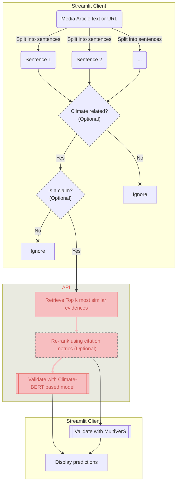

# Relevant Scientific Evidence Retrieval and Verification API for Climate impact related queries

## Overview

The API is created to perform scientific verification of claims
extracted from Climate Change related news articles in order to detect
potential inaccuracies of the latter.

### General workflow

## Main functionality
**The API performs 2 main tasks**
- Evidence retrieval for given claim(s) under all `evidence` endpoints
- Evidence retrieval + verification for given claim(s) under all `vefify` endpoints
- Supplementary task of splitting text into sentences under `split` endpoint
to enable Chrome extension functioning

### Model for claim verification against retrieved evidence

[Climatebert-fact-checking model](https://huggingface.co/amandakonet/climatebert-fact-checking) 
available from huggingface

### Scientific evidences index and database
Please read [Evidence database creation](doc/db.md) section

### Split into sentences
[Spacy "en_core_web_sm" pipeline](https://spacy.io/models/en#en_core_web_sm)
is used for text segmentation task  
This model is the smallest and the fastest and according to spacy's 
[Accuracy Evaluation](https://spacy.io/models/en#en_core_web_sm-accuracy) has
the same metric values as the bigger CPU-optimized models

### API description
[Formal description of the API](doc/api.md)

## Local development and deployment
Please refer to the [Technical documentation](doc/tech.md)