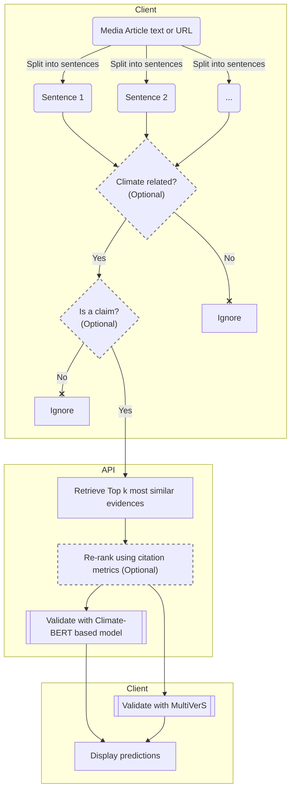

# Relevant Scientific Evidence Retrieval and Verification API for Climate impact related queries

## Main concepts

The API is created to perform scientific verification of claims
extracted from Climate Change related news articles in order to detect
potential inaccuracies of the latter.

### General workflow



### Main functionality
**The API performs 2 main tasks**
- Evidence retrieval for given claim(s) under all `evidence` endpoints
- Evidence retrieval + verification for given claim(s) under all `vefify` endpoints
- Supplementary task of splitting text into sentences under `split` endpoint
to enable Chrome extension functioning

#### Model for claim verification against retrieved evidence

### Scientific evidences index and database
Please read [Evidence database creation](doc/db.md) section

### API description
[Formal description of the API](doc/api.md)

## Local development

1. Create a python3.10-based virtual environment
2. Download SQLight dbs with metadata and FAISS indices from Google Drive
1. Switch to the created virtual env and install the dependencies
    ```bash
    pip install -r requirements.txt
    pip install $(spacy info en_core_web_sm --url)
    ```
1. Run the app by executing [evidence_api.py](evidence_api.py)
1. Open [http://127.0.0.1:8000/docs](http://127.0.0.1:8000/docs) to see API specification

## Generate Markdown from OpenAPI schema

[api.md](doc/api.md) is generated from [openapi.json](doc/openapi.json) using
[widdershins](https://mermade.github.io/widdershins/ConvertingFilesBasicCLI.html)
the following way
```shell
widdershins --language_tabs 'python:Python' 'shell:Shell' 'javascript:Javascript' --summary -o doc/api.md doc/openapi.json
```